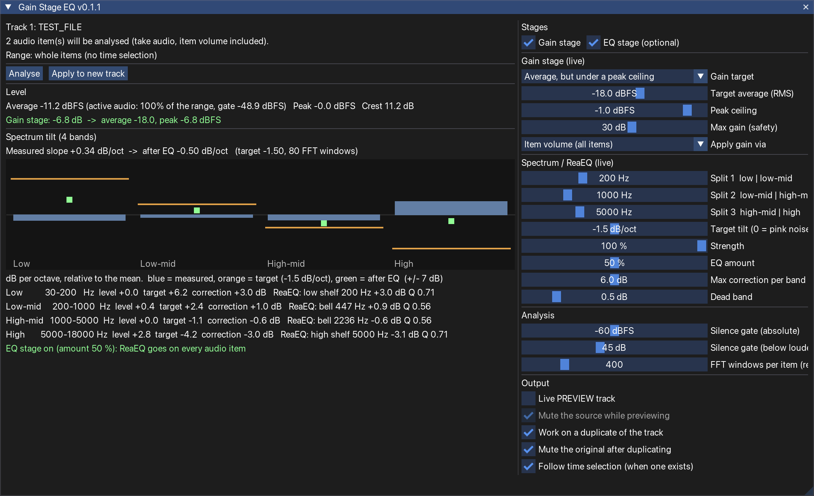

# Gain Stage EQ v0.1.0 – level a track and even out its spectrum in REAPER



Scans **all audio items on one selected track**, measures **average and peak level**, applies a **gain** to hit your target,
then measures the energy in **four frequency bands**, computes the tilt of the spectrum and sets up **ReaEQ**
(low shelf, two bells, high shelf) to pull it toward a target tilt. The EQ phase is optional, and so is the JSFX.
One action (`GainStageEQ.lua`), one ReaImGui window.

## Quick start (macOS)

```bash
cd gain-stage-eq
./install_mac.sh
```

Then in REAPER: *Actions → Show action list → search "Gain Stage EQ" → run **Script: GainStageEQ.lua***
(If REAPER was open during the install, use *New action → Load ReaScript…* and pick
`~/Library/Application Support/REAPER/Scripts/GainStageEQ/GainStageEQ.lua`.)

Needs **ReaImGui** (*Extensions → ReaPack → Browse packages → "ReaImGui"*). Portable REAPER: `./install_mac.sh --portable <folder>`.
Uninstall: `./install_mac.sh --uninstall`. Your projects are never touched.

## Using it

1. Select **one track** with audio items. Optionally make a time selection: only that range is analysed.
2. **Analyse** – reads the source audio of every item (level frames + FFT windows).
3. Adjust the sliders on the right; the results and the 4-band chart update **live**. Only *FFT windows per item* needs Analyse again.
4. **Apply to new track** – duplicates the track (named `<track> [gain-eq]`), applies the gain and adds/updates ReaEQ. One undo step.

| Setting | What it does |
|---|---|
| Gain stage / EQ stage | Switch each stage on or off. EQ off = no ReaEQ is added. Gain off = level untouched |
| Gain target | *Average* (RMS of the active audio), *Peak*, or *Average, but under a peak ceiling* (default: -18 dBFS avg, ceiling -1 dBFS) |
| Max gain | Safety limit on the gain (default ±30 dB) |
| Apply gain via | *Item volume* (all items, default), *Track volume*, or *JSFX trim* (optional, see below) |
| Split 1 / 2 / 3 | Band edges, default 200 / 1000 / 5000 Hz → Low, Low-mid, High-mid, High |
| Target tilt | Slope in dB/octave relative to pink noise; 0 = equal energy per octave, default -1.5 |
| Strength / Max correction / Dead band | How much of the error is corrected, per-band limit (6 dB), and the size under which a band is left alone |
| Silence gate | Frames below -60 dBFS or 45 dB under the loudest frame do not count as "active" |
| Work on a duplicate / Mute original | Non-destructive by default |

How the EQ is derived: the spectrum of the active audio is averaged per band, a least-squares line gives the measured
tilt in dB/oct, the difference to the target line gives each band's correction, and the four ReaEQ bands are fitted (iteratively,
at the band centres) so their combined response matches those corrections. Re-running on the same track updates the
ReaEQ named "GainStageEQ" instead of adding another.

**JSFX trim (optional):** choosing *JSFX trim* installs `Effects/GainStageEQ/GainStageEQTrim.jsfx` into your REAPER resource
folder and puts it first on the track. Nothing else needs it.

## Verified vs. NOT verified

Verified offline (`dev/tools/run_tests.sh`, 169 checks, any Lua 5.3+):
- the maths on synthetic audio (FFT, band levels, known tilts, gain modes, limits, EQ fit, silence and mono / 48 kHz sources),
- the REAPER-facing code against an in-memory fake of the API (selection, time-sliced analysis, time selection, cancel,
  duplicate, item / track / JSFX gain, ReaEQ set-up and re-use),
- the window code with a stubbed ImGui and the built bundle's real defer loop,
- the installer against a fake REAPER folder (install, re-install, uninstall).

**Not run inside REAPER – I could not.** Things only REAPER can confirm:
- ReaEQ's real parameter names (`Freq-…`, `Gain-…`, `Q-…`) and how it parses formatted values. The fake mimics them; if a real
  build differs, the window shows a ReaEQ warning instead of failing silently.
- Adding the JSFX at chain position 0 (`TrackFX_AddByName` with -1000) and renaming the ReaEQ instance (`renamed_name`).
- The audio accessor time base (same probe logic as Spike Leveler).
- How the window and 4-band chart look.

Treat the first runs as a test: apply to the duplicate, check the ReaEQ, listen.
